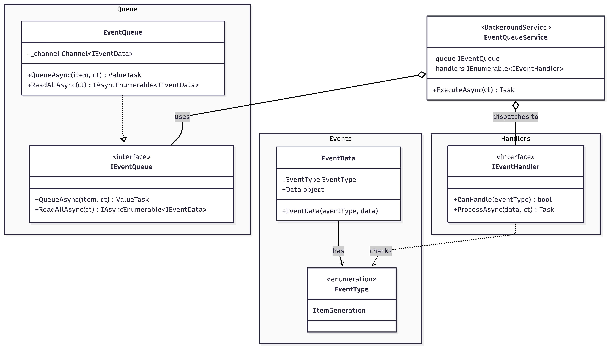

# Event Queue
When executing methods that can take some time, like making an API call to an AI model to make new Items, or running algorithms that can take a while. This event queue can be used to queue these items, bundle similar requests together and to extract the long functions from the general services.
**Note: This queue should mostly be used for events which the user won't see the direct result of as time guarantees for execution __cannot__ be made.**

## UML Diagram
An overview of the structure and flow of the queue can be seen in the UML diagram below.


## EventQueueService
The event queue service is responsible for continuously running the queue. It implements the `BackgroundService` base class from the ASP.NET Core library. The most important function is the ExecuteAsync, which is the function that is constantly run by the service, and handles each queued element.

```C#
abstract class BackgroundService(){
    Task ExecuteAsync(CancellationToken);
    Task StartAsync(CancellationToken);
    Task StopAsync(CancellationToken);
}
```

The EventQueueService takes an `IEventQueue` and an `IServiceProvider`. The IEventQueue is the actual queue, containing all the events and queue functionality. And the IServiceProvider is used to create a new scope to prevent captive dependency issues.
The first lines of the ExecuteAsync function create a new scope and gathers all the handlers which have been created. 

```C#
public class EventQueueService(
    IEventQueue queue, 
    IServiceProvider serviceProvider
) : BackgroundService
{
    protected override async Task ExecuteAsync(CancellationToken cancellationToken)
    {
        using var scope = serviceProvider.CreateScope();
        var handlers = scope.serviceProvider.GetServices<IEventHandler>();

        ..
    }
}
```

## EventQueue
The EventQueue class implements the queue functionality of the event queue. 

```C#
public interface IEventQueue
{
    ValueTask QueueAsync(IEventData eventItem, CancellationToken cancellationToken);
    IAsyncEnumerable<IEventData> ReadAllAsync(CancellationToken cancellationToken);
}
```

The current implementation of the queue makes use of a `Channel` provided by System.Threading library. The channel implements the producer/consumer paradigm and passes data from one party to another. In this implementation, the producers are the service classes of the API module. The consumer class is the `EventQueueService`, which handles all the queued items.

## EventData
To keep the queue as generic as possible, the queue stores `EventData`, indicating the type of the event and the data corresponding to the event. This allows the single queue to be used for all types of events which use different types of data.
```C#
public class EventData(EventType eventType, object data)
{
    public EventType EventType { get; } = eventType;
    public object Data { get; } = data;
}
```

## EventType
The EventType is an enum containing all the different types of events that can be handled in the queue. Currently the following events can be handled by the queue:
- ItemGeneration

## IEventHandler
The event handlers implement the concrete handler for each of the events. 
The CanHandle method is used for selecting the correct handler when dequeuing an `IEventData`. 
The second function actually executes the action belonging to the event and should contain at least the following steps:
1. Parse IEventData to the correct datatype
2. Execute and await the task to execute

```C#
public interface IEventHandler
{
    bool CanHandle(EventType eventType);
    Task ProcessAsync(IEventData data, CancellationToken cancellationToken);
}
```

# Creating a new event
Creating a new event should be fairly straightforward:
1. Create a new `EventType`.
1. Think about the data that should be stored inside the `EventData`, and create a (or use an existing) class, struct or record for it.
1. Create a new handler that implements the `IEventHandler` and can handle the new event. 
1. Add the new handler to the scope of the program.

And voilà you just created a new event that can be handled by the queue!